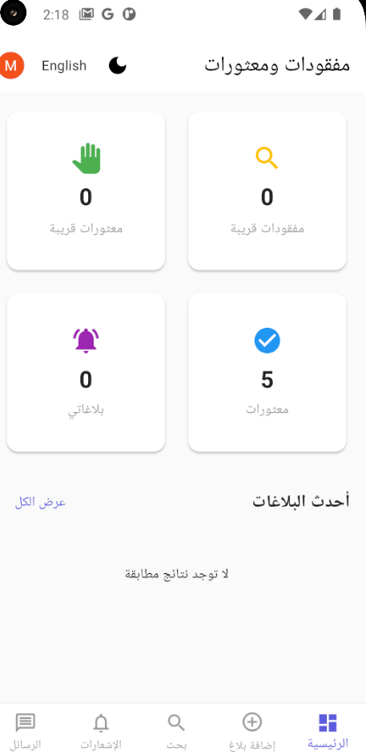
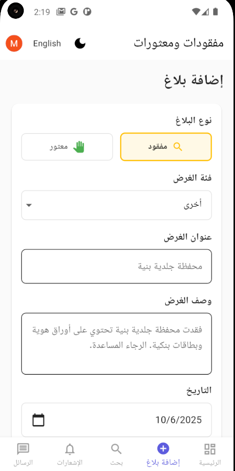
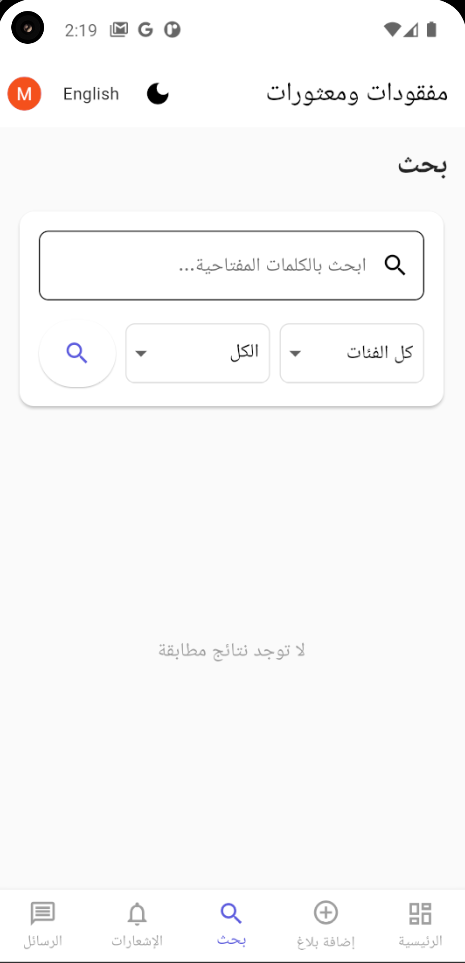

# firebas

A new Flutter project.

## 📱 Screenshots

| واجهة 1 | واجهة 2 | واجهة 3 |
|--------|--------|--------|
|  |  |  |

| واجهة 4 | واجهة 5 |
|--------|--------|
|  |  |

---

## Getting Started

This project is a starting point for a Flutter application.

A few resources to get you started if this is your first Flutter project:

- [Lab: Write your first Flutter app](https://docs.flutter.dev/get-started/codelab)
- [Cookbook: Useful Flutter samples](https://docs.flutter.dev/cookbook)

For help getting started with Flutter development, view the
[online documentation](https://docs.flutter.dev/), which offers tutorials,
samples, guidance on mobile development, and a full API reference.
